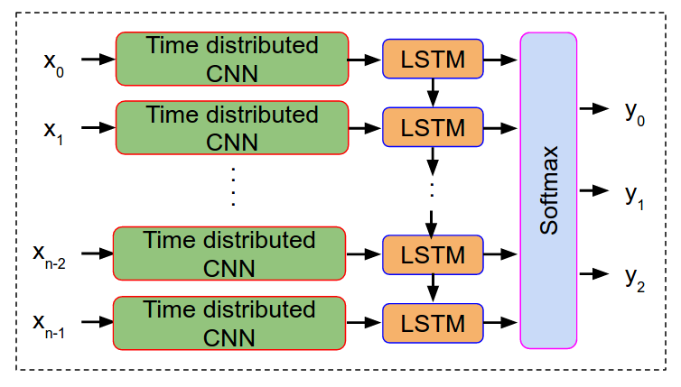

Video Quality Assessment using Deep Learning
============================================

A Keras and Tensorflow implementation of video quality assessment using deep neural networks is proposed. We propose CNN + LSTM architecture to recognize and synthesize both spatial and temporal artifacts of video impairements respectively. The architecture is shown below and is borrowed from the following paper.

* [Handcrafted vs Deep Learning Classification for Scalable Video QoE Modeling](https://arxiv.org/pdf/1901.03404.pdf)
Mallesham Dasari§, Christina Vlachou†, Shruti Sanadhya†‡, Pranjal Sahu§, Yang Qiu§, Kyu-Han Kim†, Samir R. Das§
§Stony Brook University, †HPE Labs, ‡Facebook

Network Architecture
--------------------

  

Training
-----------

- We used video samples of 30 seconds each to train the model.
- We first extract individual frames of the video from each video sample and create a numpy array out frames.
- We create numpy array of MOS (i.e, video quality mean opinion score collected from users) that is corresponding to each sample.
- We feed these frames of a video sample to CNNs followed by a series of Time Distributed LSTM. 
- Finally, a softmax is used to classify the video sample quality.

Prerequisites
-------------

- Python3
- Tensorflow
- Keras
- Jupyter Notebook (optional)

Authors
-------

**Mallesham Dasari, Pranjal Sahu, Yang Qiu**
